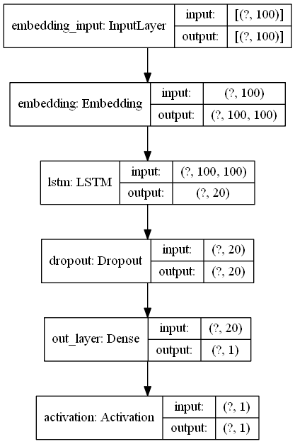
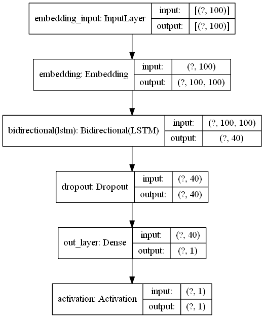
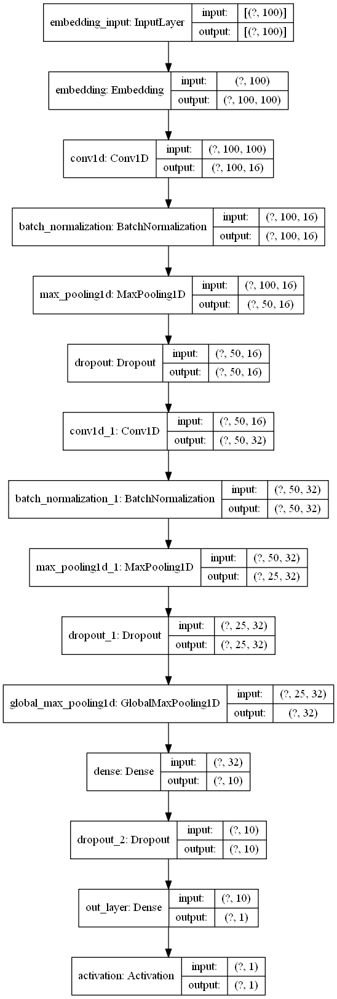
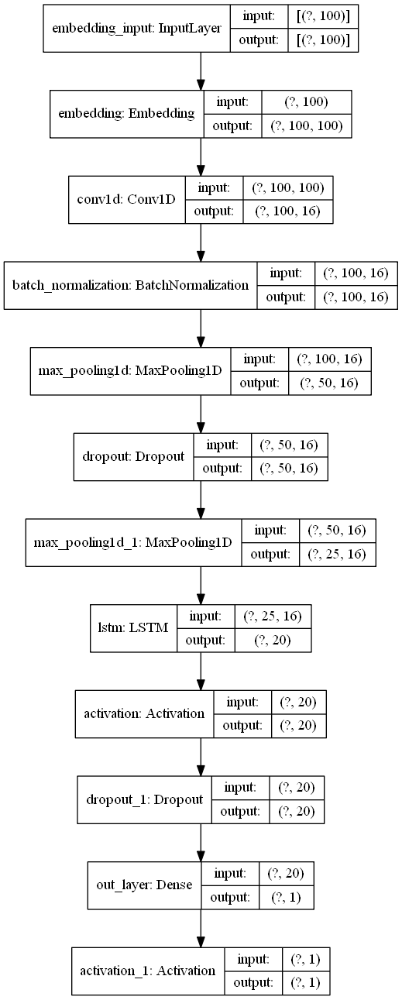

# NLP disaster tweets
Participating in [this](https://www.kaggle.com/c/nlp-getting-started/overview) Kaggle challenge.

## Achieved results

| Model              | Train acc | Val acc | Train loss | Val loss |
|--------------------|-----------|---------|------------|----------|
| LSTM               | 0.95      | 0.72    | 0.13       | 1.91     |
| Bidirectional LSTM | 0.96      | 0.72    | 0.10       | 2.57     |
| CNN                | 0.77      | 0.76    | 0.49       | 0.52     |
| CNN + LSTM         | 0.84      | 0.77    | 0.38       | 0.58     |

# Models
## LSTM Models

### LSTM Model
This is just a basic LSTM model.

Hparam search conclusions (best model):
* Dropout    = 0.2
* LSTM_out   = 20
* Optimizer  = RMSprop

Model does overfit quite a lot. Simpler/more complex models does not seem to reduce the overfit and also the optimizer does not seem to make a large difference.
Small size of the dataset could also play a role with the overfit.

### Bidirectional LSTM Model
Model with bidirectional LSTM's. The bidirectionality of the LSTM will basically create two LSTM's one from the past to 
future and the other one from future to past. In this way you preserve information from the future, and using the two 
hidden states combined you are able preserve information from both past and future.

What they are suited for is a very complicated question but BiLSTMs show very good results as they can understand 
context better, and this is what we actually want with our tweet sentiment NLP model ;) I will try to explain through an 
example;

Lets say we try to predict the next word in a sentence, on a high level what a unidirectional LSTM will see is
"The boys went to ...."

And will try to predict the next word only by this context, with bidirectional LSTM you will be able to see information 
further down the road for example
  Forward LSTM:
  
    "The boys went to ..."
  Backward LSTM:
  
    "... and then they got out of the pool"

Hparam search conclusions (best model):
* Dropout        = 0.5
* LSTM out       = 20
* Optimizer      = Adam

### Bidirectional LSTM Model

| LSTM Model         | Bidirectional LSTM Model|
|--------------------|-----------|
|               |  |

## Convolutional Models
| CNN Model         | CNN + LSTM Model|
|--------------------|-----------|
|               |  |

