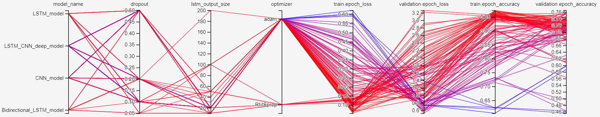

# NLP disaster tweets
Participating in [this](https://www.kaggle.com/c/nlp-getting-started/overview) Kaggle challenge.

## Achieved results

During this challenge, we've implemented a variety of different networks. Using Keras and Tensorboard, we tried to sweep over the relevant parameters of the network. We tried experimenting with the following hyperparameters:
* General
  * Dropout (between 0.0 and 0.50)
  * Optimizer (Adam and RMSprop)
* LSTM Models
  * Dimensionality of the output space (10-200)
* CNN Modles
  * Number of modules (1-3)
  * Filter size (1-5)
  * Number of filters (10-64)

| Model              | Train acc | Val acc | Train loss | Val loss |
|--------------------|-----------|---------|------------|----------|
| LSTM               | 0.95      | 0.72    | 0.13       | 1.91     |
| Bidirectional LSTM | 0.96      | 0.72    | 0.10       | 2.57     |
| CNN                | 0.77      | 0.76    | 0.49       | 0.52     |
| CNN + LSTM         | 0.84      | 0.77    | 0.38       | 0.58     |

# Models
## LSTM Models

### LSTM Model
This is just a basic LSTM model.

Hparam search conclusions (best model):
* Dropout    = 0.2
* LSTM_out   = 20
* Optimizer  = RMSprop

Model does overfit quite a lot. Simpler/more complex models does not seem to reduce the overfit and also the optimizer does not seem to make a large difference.
Small size of the dataset could also play a role with the overfit.

### Bidirectional LSTM Model
Model with bidirectional LSTM's. The bidirectionality of the LSTM will basically create two LSTM's one from the past to 
future and the other one from future to past. In this way you preserve information from the future, and using the two 
hidden states combined you are able preserve information from both past and future.

What they are suited for is a very complicated question but BiLSTMs show very good results as they can understand 
context better, and this is what we actually want with our tweet sentiment NLP model ;) I will try to explain through an 
example;

Lets say we try to predict the next word in a sentence, on a high level what a unidirectional LSTM will see is
"The boys went to ...."

And will try to predict the next word only by this context, with bidirectional LSTM you will be able to see information 
further down the road for example
  Forward LSTM:
  
    "The boys went to ..."
  Backward LSTM:
  
    "... and then they got out of the pool"

Credits to, and for more information about bidirectional-LSTM's see: https://medium.com/@raghavaggarwal0089/bi-lstm-bc3d68da8bd0

Hparam search conclusions (best model):
* Dropout        = 0.5
* LSTM out       = 20
* Optimizer      = Adam

| LSTM Model         | Bidirectional LSTM Model|
|--------------------|-----------|
|               |  |

## Convolutional Models
### CNN Model
Model with convolutional modules.

Theoretical motivation:
Convnets make sense to use for computer vision, and comparing to that, in vision the filters slide over local patches
in the image, but in NLP we typically use filters that slide over full rows of the vector (in which the words or 
tokenized words are. 

The conv_filter_size (window size) determines the size of the window that hovers over the input sentence. The idea is
that the kernel is going to hover over a certain area and apply the convolution operation.

For more information about CNN's with NLP see: http://www.wildml.com/2015/11/understanding-convolutional-neural-networks-for-nlp/

Hparam search conclusions (best model):
* Dropout        = 0.5
* Optimizer      = Adam
* Conv_filt_size = 1
* Conv_num_mods  = 2
* Conv_num_filts = 16  

Compared to the LSTM model, the overfit reduced by a lot, and overall performance increased. Furthermore, we could conclude that
a very simple 2 module conv net, is performing better at predicting the NLP sequence data, than a more complex one. 

### CNN + LSTM Model
Model with convolutional modules + LSTM placed after that.

Theorethical motivation:
Convolutional neural networks can be powerful feature extractors (and they have especially proven their effectiveness in computer vision related tasks), however we also expect them to be able to extract features from our tokenized sequence of words, which is a sentence. 

The features that the CNN has extracted are then input to a LSTM 

Hparam search conclusions:
*Tested models with varying amount of Dropout, conv filter size, number of conv modules and number of conv filters.
 the number of lstm_out = 20, as this was the best value for the separate LSTM model, and otherwise it would increase
 the amount of models in the hparam search by a lot.

Hparam search conclusions (best model):
* Dropout        = 0.5
* Optimizer      = Adam
* Conv_filt_size = 1
* Conv_num_mods  = 1
* Conv_num_filts = 16

This model is performing very similar to the model with just convolutional modules, however it is showing slightly more
overfit. This can be due to the LSTM modules, like we saw in the LSTM model.

| CNN Model         | CNN + LSTM Model|
|--------------------|-----------|
|               |  |

